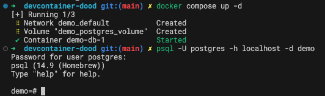
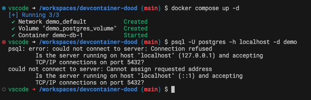

# devcontainer docker-out-of-docker

This repo exists to a demo a problem I'm having. I'm using devcontainer feature
docker-outside-of-docker
(https://github.com/devcontainers/features/tree/main/src/docker-outside-of-docker)
to run docker inside a devcontainer.

If I run `docker compose` to stand up a postgres container and connect to it using
`psql`, all issued from my host machine, it works fine.

```shell
docker compose up -d
psql -U postgres -h localhost -d demo
```




If I run the same commands from inside this repo's devcontainer, I get an error.

